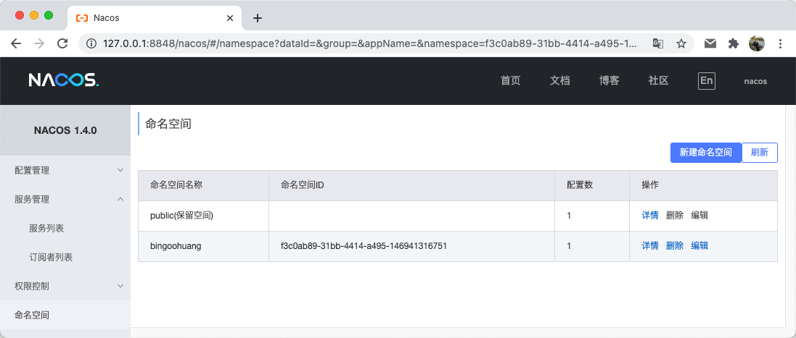
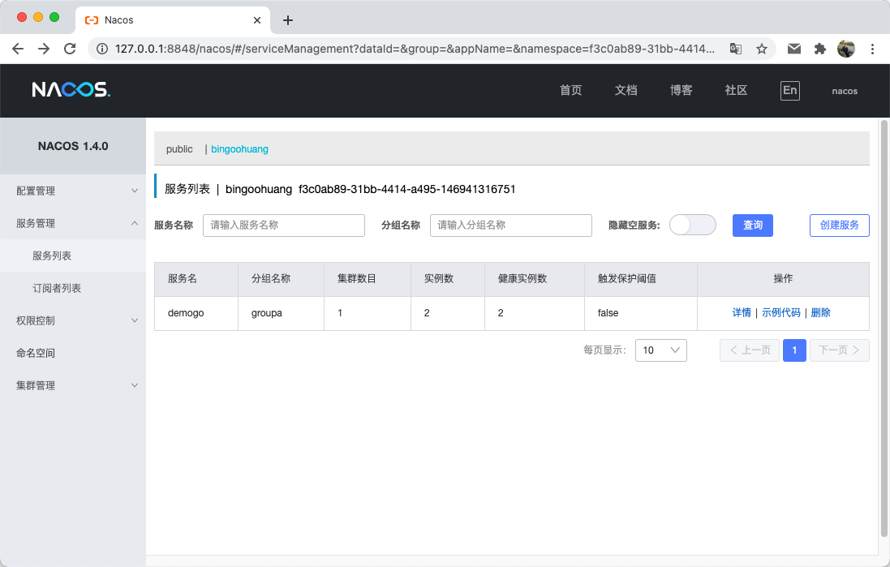
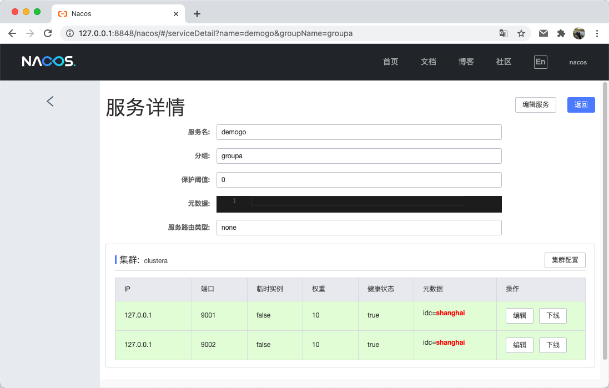
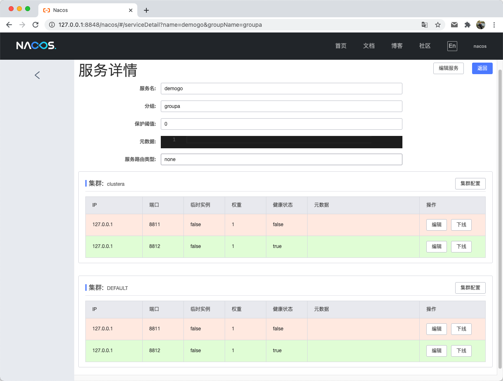
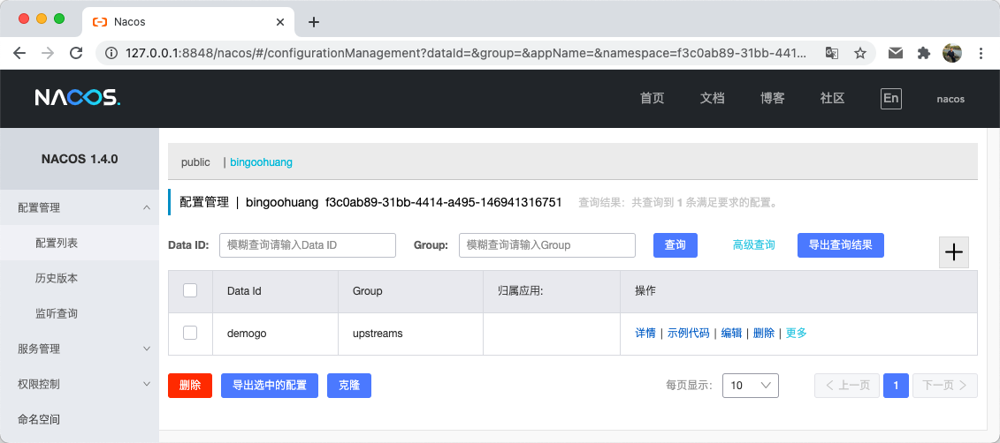

# nacos 服务发现及配置

> 实现备注: 暂时还是轮询方案，没有实现订阅模式.

1. 启动服务器
    - 参考 [Nacos 快速开始](https://nacos.io/zh-cn/docs/quick-start.html)
    - `git clone https://github.com/alibaba/nacos.git`
    - `cd nacos/`
    - `mvn -Prelease-nacos -Dmaven.test.skip=true clean install -U`
    - `ls -al distribution/target/`
    - `cd distribution/target/nacos-server-$version/nacos/bin`
    - 启动命令(standalone代表着单机模式运行，非集群模式): `sh startup.sh -m standalone`
    - 关闭服务器 `sh shutdown.sh`
1. 服务注册&发现和配置管理
    - `export NACOS_SR=http://127.0.0.1:8848/nacos/v1`
    - `export NACOS_NS=f3c0ab89-31bb-4414-a495-146941316751`
    - 服务注册`curl -X POST "$NACOS_SR/ns/instance?&namespaceId=$NACOS_NS&serviceName=groupa@@demogo&clusterName=clustera&ip=127.0.0.1&port=8811&ephemeral=false"`
    - 服务注册`curl -X POST "$NACOS_SR/ns/instance?&namespaceId=$NACOS_NS&serviceName=groupa@@demogo&clusterName=clustera&ip=127.0.0.1&port=8812&ephemeral=false"`
    - 服务发现`curl -X GET  "$NACOS_SR/ns/instance/list?namespaceId=$NACOS_NS&serviceName=groupa@@demogo"`
    - [json url encode](https://onlinejsontools.com/url-encode-json)
    - 配置公共参数 `curl -X POST "$NACOS_SR/cs/configs?tenant=$NACOS_NS&dataId=demogo&group=upstreams&content=%7B%22keepalive%22%3A13%7D&type=JSON"`
    - 查看公共参数 `curl -X GET  "$NACOS_SR/cs/configs?tenant=$NACOS_NS&dataId=demogo&group=upstreams"`
1. 问题
    - [code:503,msg:server is DOWN now, please try again later!](https://github.com/alibaba/nacos/issues/4210), 删除`{nacos.home}/nacos/data/protocol`文件夹后重新启动。
1. reference
    - [nacos-sdk-go](https://github.com/nacos-group/nacos-sdk-go)
    - [nacos open-api](https://nacos.io/zh-cn/docs/open-api.html)
   
## nacos管理界面截图

